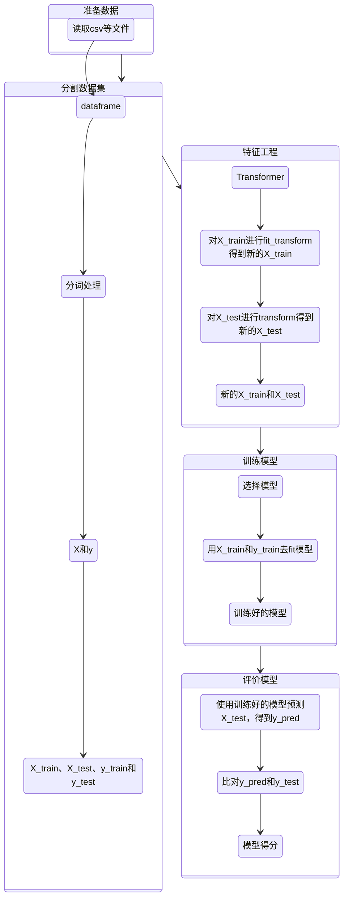

# 机器学习流程

```mermaid
stateDiagram 
    准备数据 --> 分割数据集
    分割数据集 --> 特征工程
    特征工程 --> 训练模型
    训练模型 --> 评价模型
 
   
    state 准备数据 {
        读取csv等文件 --> dataframe
    }   
    
    state 分割数据集 {
       dataframe --> 分词处理 
       分词处理 --> X和y
       X和y --> X_train、X_test、y_train和y_test
    }
    
    state 特征工程 {
        Transformer --> 对X_train进行fit_transform得到新的X_train 
        对X_train进行fit_transform得到新的X_train --> 对X_test进行transform得到新的X_test 
        对X_test进行transform得到新的X_test --> 新的X_train和X_test

    }
    

    
    
    state 训练模型 {
    	 选择模型 --> 用X_train和y_train去fit模型
    	 用X_train和y_train去fit模型 --> 训练好的模型
    	 
    }
    
    state 评价模型 {
    	 使用训练好的模型预测X_test，得到y_pred -->  比对y_pred和y_test
    	 比对y_pred和y_test --> 模型得分
    }
    
   
    
    

```

